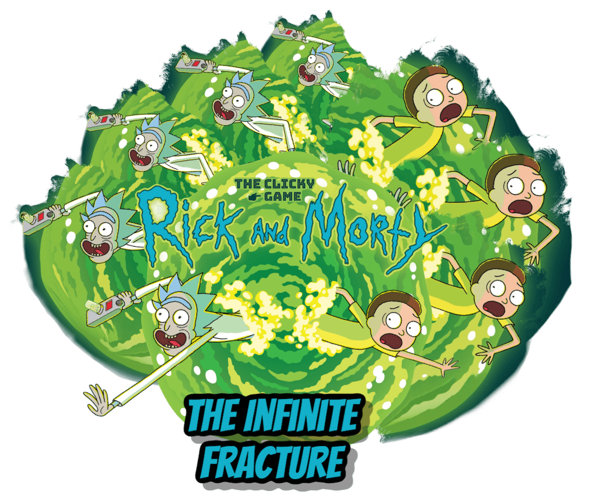
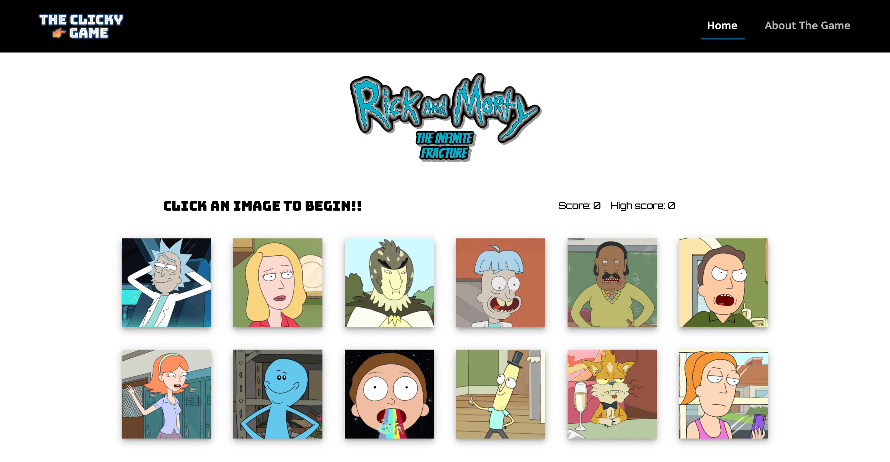

# Clicky Game - Rick and Morty

Rick and Morty The Clicky Game is a virtual memory game created with ReactJS, MaterialUI and NodeJS

## How to install and run

In order to use the program, you will need to follow this steps: 

            1. git clone https://github.com/alfa9317/the-clicky-game
            2. cd into the the-clicky-game
            3. Run npm install to all dependencies
            4. Run npm start
            5. Go to localhost:3000 in your web browser
            
            You will need to have previously installed NodeJS

## --------------------👉🏻

## I just want to play!

You can also just go to this url and start playing:
      https://alfa9317.github.io/the-clicky-game/

Required technologies:
NodeJS,
ReactJS,
MaterialUI,
Visual Studio Code.
